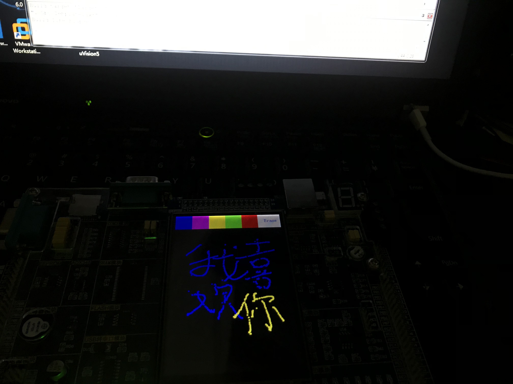

### stm32pz6806d+XPT2046(电阻屏)实验

>#### 前提：
>
>TFTLCD模块使用的是四线电阻式触摸屏；
>
>接线：
>
>**电阻式触摸屏介绍**
>
> 电阻式触摸屏是一种传感器，它将矩形区域中触摸点(X,Y)的物理位
>
>置转换为代表X坐标和Y坐标的电压。电阻触摸屏的工作原理主要是通过
>
>压力感应原理来实现对屏幕内容的操作和控制的。
>
>### 初始化io口：
>
>#### 1.由于触摸屏的数据传输是采用spi通信，因此要配置spi相关io口和打开spi外设时钟，通过接线图可知配置：
>
>RCC_APB2PeriphClockCmd(RCC_APB2Periph_GPIOD, ENABLE);
>GPIO_InitStructure.GPIO_Pin = GPIO_Pin_6;
>GPIO_InitStructure.GPIO_Mode = GPIO_Mode_Out_PP;
>GPIO_InitStructure.GPIO_Speed = GPIO_Speed_50MHz;  
>
>GPIO_Init(GPIOD, &GPIO_InitStructure);
>
>#### 2.配置touch_cs的io口设置：
>
>GPIO_InitStructure.GPIO_Pin = GPIO_Pin_6;
>GPIO_InitStructure.GPIO_Mode = GPIO_Mode_Out_PP;
>GPIO_InitStructure.GPIO_Speed = GPIO_Speed_50MHz;
>
>GPIO_Init(GPIOD, &GPIO_InitStructure);
>
>#### 3.配置touch_pen的io口配置：
>
>GPIO_InitStructure.GPIO_Pin = GPIO_Pin_7;
>GPIO_InitStructure.GPIO_Mode = GPIO_Mode_IPU;
>
>GPIO_Init(GPIOD, &GPIO_InitStructure);
>
>### 调用spi配置函数初始化spi：
>
>根据接线图可知模块使用的是spi1，所以调用spi1初始化函数进行配置。
>
>SPI1_Init();
>
>### 设置获取触摸点x，y的方式：
>
>* 1.实验室采用的显示屏是TFTLCD_ILI9481，其分辨率为320\*480，即有一个横轴为320纵轴为480的坐标轴。
>* 2.我们可以将触摸屏分成4000\*4000然后将读取到的点根据比例换算到320\*480到上
>* 物理坐标=(在4000\*4000上读取到的坐标）\*(比例系数)+（偏移量）
>
>#### 因此要根据设计的方式计算出4个值：
>
>#### x的比例系数xFactor，y的比例系数yFactor；
>
>#### x的偏移量TouchAdj.xOffset，y的偏移量TouchAdj.yOffset；
>
>#### 定义一个数组将数据保存：
>
>#### typedef struct{
> 	uint8_t posState;     （标志，若计算完成填入TOUCH_ADJ_OK）
>    int16_t xOffset;
>    int16_t yOffset; 
>    float xFactor;
>    float yFactor;
>} PosTypeDef;
>
>将设计的4000*4000保存到：
>
>#define TOUCH_X_MAX      4000  //即x的最大值为4000
>
>#define TOUCH_Y_MAX      4000  //即y的最大值为4000
>
>与此同时我们还要设计一个最小值：
>
>#define TOUCH_X_MIN      10  //即x的最小值为10
>
>#define TOUCH_Y_MIN      10  //即y的最小值为10
>
>设计算法计算出比例系数跟偏移量：
>
>void TOUCH_Adjust(void)
>{  
>	float xFactor, yFactor;
>    /计算比例系数/
>    xFactor = (float)LCD_ADJ_X / (TOUCH_X_MAX - TOUCH_X_MIN);
>    yFactor = (float)LCD_ADJ_Y / (TOUCH_Y_MAX - TOUCH_Y_MIN);   
>    /计算偏移量/
>    TouchAdj.xOffset = (int16_t)LCD_ADJX_MAX - ((float)TOUCH_X_MAX * xFactor);
>    TouchAdj.yOffset = (int16_t)LCD_ADJY_MAX - ((float)TOUCH_Y_MAX * yFactor);
>    /将偏移量填入数组/
>    TouchAdj.xFactor = xFactor ;
>    TouchAdj.yFactor = yFactor ;
>    TouchAdj.posState = TOUCH_ADJ_OK;           
>}
>
>~~~
>将上面的io口配置，spi初始化，以及比例系数偏移量等封装进触摸初始化函数void TOUCH_Init(void)
>~~~
>
>### 设计获取触摸点坐标x，y的函数：
>
>uint16_t TOUCH_ReadData(uint8_t cmd)
>{
>    uint8_t i, j;
>    uint16_t readValue[TOUCH_READ_TIMES], value;
>    uint32_t totalValue;
>	/\* SPI的速度不宜过快 \*/
>    SPI1_SetSpeed(SPI_BaudRatePrescaler_16);	
>    /\* 读取TOUCH_READ_TIMES次触摸值 \*/
>    for(i=0; i<TOUCH_READ_TIMES; i++)
>    {   /\* 打开片选 \*/
>        TCS=0;
>        /\* 在差分模式下，XPT2046转换需要24个时钟，8个时钟输入命令，之后1个时钟去除 \*/
>        /\* 忙信号，接着输出12位转换结果，剩下3个时钟是忽略位 \*/    
>        SPI1_ReadWriteByte(cmd); // 发送命令，选择X轴或者Y轴      
>        /\* 读取数据 \*/
>        readValue[i] = SPI1_ReadWriteByte(0xFF);
>        readValue[i] <<= 8;
>        readValue[i] |= SPI1_ReadWriteByte(0xFF);    
>        /\* 将数据处理，读取到的AD值的只有12位，最低三位无用 \*/
>        readValue[i] >>= 3;     
>        TCS=1;
>    }
>    /\* 滤波处理 \*/
>    /\* 首先从大到小排序 \*/
>    for(i=0; i<(TOUCH_READ_TIMES - 1); i++)
>    {
>        for(j=i+1; j<TOUCH_READ_TIMES; j++)
>        {
>            /\* 采样值从大到小排序排序 \*/
>            if(readValue[i] < readValue[j])
>            {
>                value = readValue[i];
>				readValue[i] = readValue[j];
>				readValue[j] = value;
>            }   
>        }       
>    }  
>    /\* 去掉最大值，去掉最小值，求平均值 \*/
>    j = TOUCH_READ_TIMES - 1;
>    totalValue = 0;
>    for(i=1; i<j; i++)     //求y的全部值
>    {
>        totalValue += readValue[i];
>    }
>    value = totalValue / (TOUCH_READ_TIMES - 2);    
>    return value;
>}
>
>其中的TOUCH_READ_TIMES课设置，即每次读取点的次数，默认为40。
>
>### 换算成物理坐标（320\*480）的函数：
>
>uint8_t TOUCH_ReadXY(uint16_t \*xValue, uint16_t \*yValue)
>{   
>    uint16_t xValue1, yValue1, xValue2, yValue2;
>    xValue1 = TOUCH_ReadData(TOUCH_X_CMD);
>    yValue1 = TOUCH_ReadData(TOUCH_Y_CMD);
>    xValue2 = TOUCH_ReadData(TOUCH_X_CMD);
>    yValue2 = TOUCH_ReadData(TOUCH_Y_CMD);  
>    /\* 查看两点间的采样差距 \*/
>    if(xValue1 > xValue2)
>    {
>        \*xValue = xValue1 - xValue2;
>    }
>    else
>    {
>        \*xValue = xValue2 - xValue1;
>    }
>    if(yValue1 > yValue2)
>    {
>        \*yValue = yValue1 - yValue2;
>    }
>    else
>    {
>        \*yValue = yValue2 - yValue1;
>    }
>    /* 判断采样差距是否在可控范围 */
>	if((\*xValue > TOUCH_MAX+0) || (\*yValue > TOUCH_MAX+0))  
>	{
>		return 0xFF;
>	}
>    / \* 求平均值 \*/
>    \*xValue = (xValue1 + xValue2) / 2;
>    \*yValue = (yValue1 + yValue2) / 2;
>    /\* 判断所取的值是否在可取范围 \*/
>    if((\*xValue > TOUCH_X_MAX+0) || (\*xValue < TOUCH_X_MIN) 
>       || (\*yValue > TOUCH_Y_MAX+0) || (\*yValue < TOUCH_Y_MIN))
>    {                   
>        return 0xFF;
>    }
>    return 0; 
>}
>
>根据物理坐标=（读取的坐标）*比例系数+偏移量
>
>偏移量可设置为0，实际尝试未发现错误。
>
>其中的TOUCH_MAX即预期差值可以设置，默认为20。
>
>